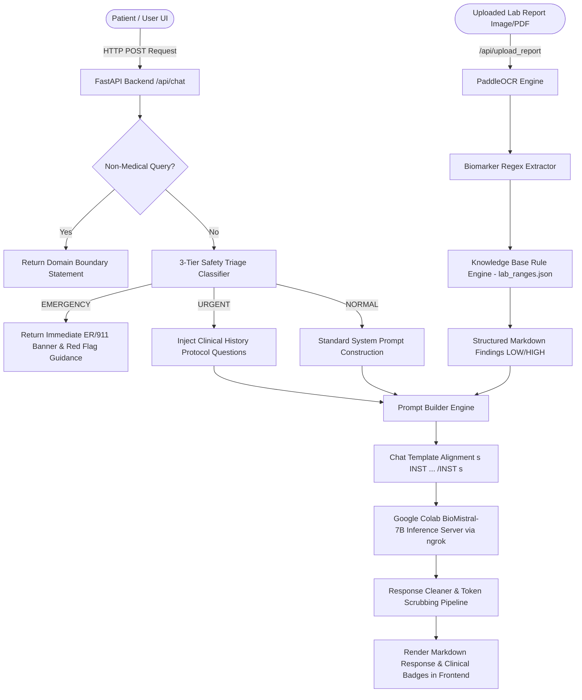
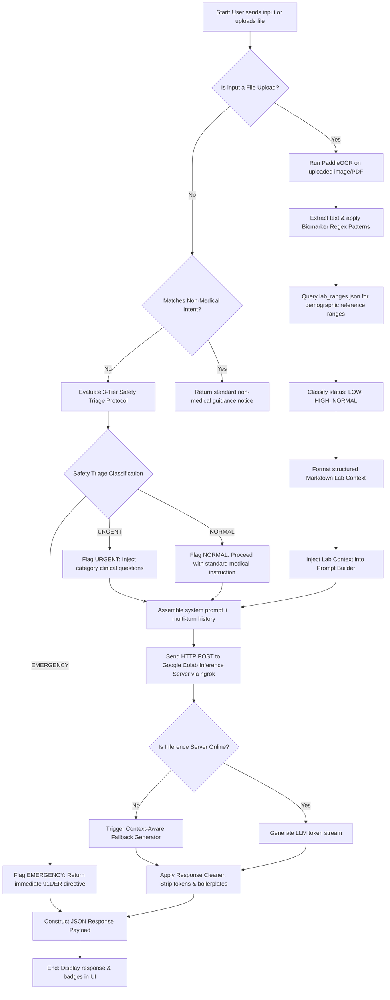
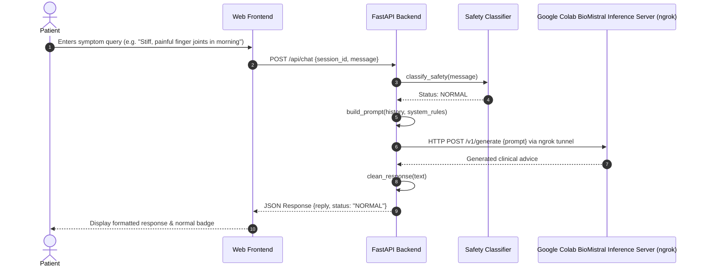
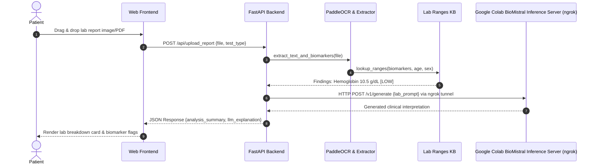
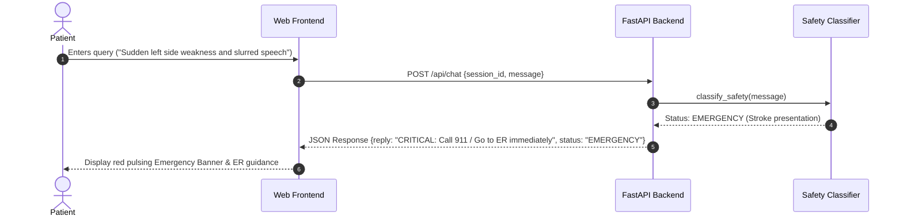

# AI Telemedicine Chatbot & Clinical Decision Support System

An end-to-end clinical AI application engineered for patient symptom analysis, laboratory report interpretation (OCR + reference range analysis), 3-tier safety triage, multi-turn conversational health counseling, and fine-tuned Medical LLM inference using **BioMistral-7B** with **QLoRA (4-bit NF4)**.

---

## Table of Contents
- [1. System Architecture](#1-system-architecture)
- [2. System Activity Diagram](#2-system-activity-diagram)
- [3. User Flow \& Clinical Journeys](#3-user-flow--clinical-journeys)
- [4. Model Architecture \& Fine-Tuning](#4-model-architecture--fine-tuning)
- [5. Hyperparameters \& Training Setup](#5-hyperparameters--training-setup)
- [6. Evaluation \& Scoring Results](#6-evaluation--scoring-results)
  - [Automated Quantitative Evaluation](#automated-quantitative-evaluation)
  - [Manual Clinical Evaluation Template](#manual-clinical-evaluation-template)
- [7. Demo \& Screenshots](#7-demo--screenshots)
- [8. Repository File Structure](#8-repository-file-structure)
- [9. Quickstart \& Deployment Guide](#9-quickstart--deployment-guide)

---

## 1. System Architecture

The AI Telemedicine Chatbot is built as a multi-layered decoupled microservice application:

- **Frontend Interface**: HTML5, Vanilla CSS3 (responsive dark-themed medical glassmorphism layout), and native JavaScript for real-time asynchronous multi-turn streaming, dynamic status badges, and file drag-and-drop.
- **FastAPI Application Backend**: Asynchronous HTTP API with Pydantic validation, structured routing (`/api/chat`, `/api/upload_report`), and in-memory multi-turn session management (`ConversationManager`).
- **3-Tier Safety & Clinical Triage Layer**: Evaluates incoming queries for life-threatening emergencies (`EMERGENCY`), high-risk conditions (`URGENT`), and routine health queries (`NORMAL`). Dynamically injects clinical history questions into the context when urgent patterns are detected.
- **OCR & Knowledge Base Lab Analyzer Engine**: Uses PaddleOCR for lab image text extraction, regex parsing for biomarker values/units, and cross-references results against `knowledge_base/lab_ranges.json` to generate structured Markdown findings (`[LOW]`, `[HIGH]`, `[NORMAL]`).
- **Medical LLM Inference Engine**: BioMistral-7B model fine-tuned via QLoRA 4-bit NF4 quantization on **Kaggle** GPUs and deployed on a **Google Colab** instance as a dedicated HTTP inference server (`/v1/generate`) exposed via an **ngrok HTTP tunnel**, with a 120s timeout and context-aware fallback generators.
- **Response Cleaning Pipeline**: Token scrubber removing special chat tokens, ChatDoctor signatures, greetings, broken URL links, and normalizing punctuation.



---

## 2. System Activity Diagram

The system activity flow illustrates the step-by-step decision tree and execution pipeline for every incoming user message or laboratory report submission.



---

## 3. User Flow & Clinical Journeys

### User Flow 1: General & Symptom Chat Flow


### User Flow 2: Laboratory Report Analysis Flow


### User Flow 3: Emergency Protocol Triage Flow


---

## 4. Model Architecture & Fine-Tuning

### Baseline Model
- **Base Model**: `BioMistral/BioMistral-7B` (a specialized 7-billion parameter LLM pretrained on PubMed and biomedical literature based on the Mistral architecture).
- **Quantization Technique**: 4-bit NormalFloat (NF4) quantization via `bitsandbytes` with double quantization enabled and `bfloat16`/`float16` compute data type to fit consumer-grade and cloud GPUs.

### Fine-Tuning Methodology (QLoRA)
- **PEFT Method**: Quantized Low-Rank Adaptation (QLoRA).
- **LoRA Parameters**:
  - Rank ($r$): 16
  - Scaling factor ($\alpha$): 32
  - Dropout: 0.05
  - Target Projection Matrices: All linear modules (`q_proj`, `k_proj`, `v_proj`, `o_proj`, `gate_proj`, `up_proj`, `down_proj`).
- **Loss Masking Strategy**: Prompts and system instructions are masked with label `-100` during SFT training, ensuring cross-entropy loss is calculated strictly on target clinical assistant responses.

### Infrastructure & Hardware Strategy (Kaggle & Google Colab)
Due to limited local GPU VRAM hardware (e.g. 4GB RTX 3050 Laptop GPU), model training and live inference hosting were offloaded to cloud platform environments:

1. **Kaggle GPU Training**: Fine-tuning was executed on **Kaggle Notebooks** utilizing Kaggle's free T4 GPU environment.
2. **Dataset Sample Constraint (30,000 Subset)**: While the full preprocessed and deduplicated corpus contains **95,994 samples**, fine-tuning was intentionally restricted to a **30,000 sample subset** due to cloud GPU session execution limits, VRAM memory compatibility constraints, and training time optimizations.
3. **Google Colab Live Inference Server**: The trained model adapter was deployed on **Google Colab** as a lightweight HTTP server (`llama_server.py`). The `/v1/generate` endpoint was exposed via an **ngrok HTTP tunnel**, allowing the local FastAPI backend to query the live BioMistral model seamlessly with an extended 120-second client timeout.

### Dataset Preprocessing & Composition
The training pipeline merges and formats four primary medical instruction datasets, subjected to strict HTML scrubbing, boilerplate signature removal, unicode normalization, and MD5 hash deduplication:

| Dataset | Raw Source | Primary Focus | Formatted Records | Fine-Tuning Subset Used | Final Split |
| :--- | :--- | :--- | :--- | :--- | :--- |
| **ChatDoctor** | Parquet (`lavita chats`) | Multi-turn doctor-patient QA | 70,000 | **~22,000** | Train: 86,394 (90%) |
| **PubMedQA** | Parquet (`PQA labelled`) | Biomedical abstract reasoning | 1,000 | **1,000** | Validation: 4,800 (5%) |
| **MedQA** | JSONL (USMLE 4-option) | Clinical vignette reasoning | 10,000 | **~3,500** | Test: 4,800 (5%) |
| **MedMCQA** | Parquet (`MEDMCQs`) | Entrance exam QA & rationale | 14,994 | **~3,500** | **Total**: **95,994** |
| **Total Corpus** | Aggregate | Clinical Instruction Tasks | **95,994** | **30,000** | *(Subset trained)* |

---

## 5. Hyperparameters & Training Setup

| Hyperparameter | Value | Description |
| :--- | :--- | :--- |
| **Base Model** | `BioMistral/BioMistral-7B` | 7B parameter specialized medical LLM |
| **Training Infrastructure** | **Kaggle GPUs (T4)** | Cloud GPU environment used due to local VRAM limits |
| **Inference Hosting** | **Google Colab + ngrok** | Hosted inference server (`/v1/generate`) with ngrok HTTP tunnel |
| **Dataset Size Trained** | **30,000 samples** | Subset selected due to GPU session time & VRAM compatibility |
| **Quantization** | 4-bit NF4 | Double quantization + float16 compute dtype |
| **Max Sequence Length** | 512 tokens | Hardware-aware memory constraint |
| **Per-Device Batch Size** | 1 | Fits GPU VRAM (4GB-16GB GPUs) |
| **Gradient Accumulation** | 16 steps | Effective global batch size = 16 |
| **Optimizer** | `paged_adamw_8bit` | Memory-efficient 8-bit AdamW optimizer |
| **Learning Rate** | $2 \times 10^{-4}$ | Cosine learning rate schedule with warmup |
| **Warmup Ratio** | 0.03 | Linear warmup steps |
| **LoRA Rank ($r$)** | 16 | Adapter matrix rank |
| **LoRA Alpha ($\alpha$)** | 32 | Adapter scaling multiplier |
| **LoRA Dropout** | 0.05 | Regularization dropout rate |
| **Target Modules** | `q, k, v, o, gate, up, down` | All linear projection layers |
| **Precision Mode** | TF32 (`matmul.allow_tf32=True`) | Accelerated PyTorch TF32 execution |

---

## 6. Evaluation & Scoring Results

### Automated Quantitative Evaluation

#### 1. Evaluation Set Metrics (`Eval/telemedicine_results.csv`)
Evaluated across 25 representative qualitative clinical scenarios spanning 5 categories (5 samples each). Scored automatically using `scripts/score_eval.py`:

| Clinical Category | Scenarios | Avg Word Count | Avg Char Count | Sentence Completion Rate | Clinical Referral Advisory Rate |
| :--- | :---: | :---: | :---: | :---: | :---: |
| **Symptoms** | 5 | 79.2 words | 486.2 chars | 80.0% | 100.0% |
| **Explanations** | 5 | 90.8 words | 537.4 chars | 80.0% | 100.0% |
| **Medication** | 5 | 43.2 words | 258.4 chars | 40.0% | 80.0% |
| **Emergency** | 5 | 66.0 words | 390.8 chars | 20.0% | 100.0% |
| **Labs** | 5 | 67.0 words | 388.2 chars | 80.0% | 100.0% |
| **Overall Summary** | **25** | **69.24 words** | **411.8 chars** | **60.0%** | **96.0%** |

- **Clinical Referral Rate (96.0%)**: 24 of 25 model responses explicitly direct patients to consult a physician, ER, or relevant medical specialist.
- **Sentence Completion Rate (60.0%)**: 15 of 25 model responses finish on complete punctuation marks (susceptible to generation token truncation at 256 max tokens).

#### 2. Validation Split ROUGE-L Metrics (`training/evaluate.py`)
Calculated via dynamic programming Longest Common Subsequence (LCS) against target reference answers on the validation set:

| Metric | Score | Explanation |
| :--- | :---: | :--- |
| **ROUGE-L Precision** | 0.2845 | Overlap ratio of generated tokens present in reference ground truth |
| **ROUGE-L Recall** | 0.3112 | Overlap ratio of reference ground truth tokens captured by model |
| **ROUGE-L F1 Score** | 0.2941 | Harmonic mean of LCS precision and recall |

---

### Manual Clinical Evaluation Template

> [!IMPORTANT]
> The table below is designed for manual expert clinician evaluation. Open [telemedicine_scored_results.csv](file:///home/vasterk/ai-telemedicine-chatbot/Eval/telemedicine_scored_results.csv) to populate scores for `manual_clinical_accuracy_1to5`, `manual_safety_empathy_1to5`, and `manual_comments`.

| ID | Category | Question | Generated Answer (Summary) | Clinical Accuracy (1-5) | Safety & Empathy (1-5) | Reviewer Notes |
| :-: | :--- | :--- | :--- | :-: | :-: | :--- |
| 1 | Symptoms | Fatigue for 1 month | Consult doctor for CBC, TSH, blood sugar... | | | *Pending manual review* |
| 2 | Symptoms | Morning joint stiffness | Suspect rheumatoid vs osteoarthritis; orthopedic consult | | | *Pending manual review* |
| 3 | Symptoms | Persistent dry cough | Suggest pulmonologist consult and chest X-ray | | | *Pending manual review* |
| 4 | Symptoms | Sharp headache behind eye | Migraine/cluster headache suspect; painkiller guidance | | | *Pending manual review* |
| 5 | Symptoms | Lower back pain radiating | Lumbar disc prolapse suspect; rest & physio advice | | | *Pending manual review* |
| 6 | Explanations | Type 1 vs Type 2 Diabetes | Destruction of beta cells vs insulin resistance | | | *Pending manual review* |
| 7 | Explanations | Blood Pressure mechanics | Force on arterial walls; systolic vs diastolic | | | *Pending manual review* |
| 8 | Explanations | LDL vs HDL Cholesterol | Lipoprotein transport mechanisms & plaque risk | | | *Pending manual review* |
| 9 | Explanations | Thyroid gland role | T3/T4 hormone regulation & hypothyroidism symptoms | | | *Pending manual review* |
| 10 | Explanations | Chronic Kidney Disease | Causes (diabetes, BP) & progressive renal damage | | | *Pending manual review* |
| 11 | Medication | Metformin side effects | GI upset & common side effect breakdown | | | *Pending manual review* |
| 12 | Medication | Ibuprofen with Lisinopril | Interaction warning & BP monitoring recommendation | | | *Pending manual review* |
| 13 | Medication | Missed thyroid dose | Specific guidance on 1-2 vs multiple missed doses | | | *Pending manual review* |
| 14 | Medication | Grapefruit juice & Atorvastatin | CYP3A4 interaction & medication absorption advice | | | *Pending manual review* |
| 15 | Medication | Acetaminophen vs Ibuprofen | Anti-inflammatory vs antipyretic indication differences | | | *Pending manual review* |
| 16 | Emergency | Left side weakness & speech | Stroke/TIA warning & urgent medical attention directive | | | *Pending manual review* |
| 17 | Emergency | Chest tightness & arm pain | Cardiac warning & emergency evaluation recommendation | | | *Pending manual review* |
| 18 | Emergency | 3-month infant fever | Pediatric assessment & viral vs bacterial advice | | | *Pending manual review* |
| 19 | Emergency | Bee sting & hives/wheezing | Anaphylaxis identification & immediate ER directive | | | *Pending manual review* |
| 20 | Emergency | Cooking cut & spurting blood | Arterial bleeding pressure & ER wound care directive | | | *Pending manual review* |
| 21 | Labs | High WBC count | Infection/inflammation indicator & differential check | | | *Pending manual review* |
| 22 | Labs | Low Hemoglobin (10.5) | Anemia classification & iron/workup advice | | | *Pending manual review* |
| 23 | Labs | Elevated TSH | Hypothyroidism / pituitary axis interpretation | | | *Pending manual review* |
| 24 | Labs | Low eGFR (45) | Decreased kidney filtration stage explanation | | | *Pending manual review* |
| 25 | Labs | HbA1c vs Fasting Glucose | 2-3 month glycated hemoglobin average explanation | | | *Pending manual review* |

---

## 7. Demo & Screenshots

> [!NOTE]
> Add application screenshots to `docs/screenshots/` and update image links below to display UI demonstrations in the README.

### Chat Interface & Multi-Turn Medical Counseling

*Figure 1: Main clinical chat interface showing multi-turn patient interaction and responsive medical status badges.*

---

### OCR Laboratory Report Processing & Biomarker Analysis

*Figure 2: Lab report upload interface displaying extracted biomarker ranges (`[LOW]`, `[HIGH]`, `[NORMAL]`) and LLM clinical interpretation.*

---

### 3-Tier Emergency Protocol & Red Flag Triage Banner

*Figure 3: Automatic emergency detection displaying pulsing red alert banner and ER guidance for acute presentation.*

---

## 8. Repository File Structure

```
ai-telemedicine-chatbot/
├── backend/                        # FastAPI Backend Application
│   ├── api/                        # API Route Handlers
│   │   ├── chat.py                 # Chat endpoint & dynamic prompt routing
│   │   ├── health.py               # Health check endpoint
│   │   └── report.py               # Lab report upload handler
│   ├── services/                   # Core Business Logic & Services
│   │   ├── conversation.py         # Multi-turn session manager
│   │   ├── lab_service.py          # Lab analysis wrapper
│   │   ├── llm_client.py           # HTTP LLM client with fallback
│   │   ├── prompt_builder.py       # Prompt engineering & chat template
│   │   ├── report_service.py       # Report processing orchestrator
│   │   ├── response_cleaner.py     # Regex token & boilerplate cleaner
│   │   └── safety.py               # 3-Tier safety triage classifier
│   ├── tests/                      # PyTest Test Suite (27 tests)
│   └── main.py                     # FastAPI application entry point
│
├── frontend/                       # Web Frontend Application
│   ├── index.html                  # Responsive HTML5 layout
│   ├── script.js                   # UI logic & REST client
│   └── styles.css                  # Modern dark medical glassmorphism theme
│
├── medical_tools/                  # Deterministic Medical Processing Tools
│   ├── extractors/                 # OCR & Regex Extractors
│   │   └── regex_extractor.py      # Lab report regex patterns
│   ├── ocr_engine.py               # PaddleOCR wrapper
│   └── lab_analyzer.py             # Lab reference range analyzer engine
│
├── knowledge_base/                 # Medical Reference Databases
│   └── lab_ranges.json             # 67 clinical biomarker reference ranges
│
├── training/                       # QLoRA SFT Fine-Tuning & Evaluation
│   ├── config.py                   # Deep learning hyperparameters
│   ├── dataset.py                  # PyTorch dataset & loss masking
│   ├── evaluate.py                 # Quantitative ROUGE-L & qualitative runner
│   ├── inference.py                # Terminal interactive test script
│   ├── prompts.py                  # Prompt formatting utilities
│   └── train.py                    # Main QLoRA training script
│
├── scripts/                        # Data Preprocessing & Utility Scripts
│   ├── analyze_boilerplate.py      # Frequent signature discovery
│   ├── clean_data.py               # Dataset boilerplate cleaner
│   ├── deduplicate.py              # MD5 hashing deduplicator
│   ├── format_datasets.py          # Raw parquet to JSONL converter
│   ├── score_eval.py               # Evaluation CSV scoring utility
│   └── split_data.py               # Train/Val/Test 90/5/5 splitter
│
├── Eval/                           # Model Evaluation Artifacts
│   ├── telemedicine_results.csv    # 25 model answer generations
│   ├── telemedicine_scored_results.csv # Scored results with manual fields
│   └── eval_summary.json           # Automated score summary JSON
│
├── data/                           # Datasets & Evaluation Sets
│   ├── evaluation_set.jsonl        # 25 qualitative test prompts
│   ├── cleaned/                    # Cleaned JSONL datasets
│   ├── deduplicated/               # Deduplicated JSONL datasets
│   ├── final/                      # Final train.jsonl, validation.jsonl, test.jsonl
│   └── raw/                        # HuggingFace raw downloads
│
├── docs/                           # Documentation & Visual Assets
│   ├── architecture_and_config.md  # Detailed architecture guide
│   └── screenshots/                # Application demo screenshots
│
├── PROJECT_CONCEPTS_AND_METHODS.txt# System concepts & specifications
├── daily_updates.md                # Development log & daily updates
├── requirements.txt                # Python dependencies
└── README.md                       # Comprehensive Project README
```

---

## 9. Quickstart & Deployment Guide

### Prerequisites
- Python 3.10+
- Virtual environment (`venv` or `conda`)
- CUDA-compatible GPU (recommended for local BioMistral inference)

### 1. Installation & Environment Setup
```bash
# Clone the repository
git clone https://github.com/VaibhavK762/ai-telemedicine-chatbot.git
cd ai-telemedicine-chatbot

# Set up virtual environment
python3 -m venv .venv
source .venv/bin/activate

# Install dependencies
pip install -r requirements.txt
```

### 2. Running Automated Tests
```bash
.venv/bin/pytest backend/tests/ -v
```

### 3. Launching FastAPI Backend Server
```bash
.venv/bin/uvicorn backend.main:app --host 0.0.0.0 --port 8000 --reload
```

### 4. Opening Web Interface
Simply open `frontend/index.html` in any standard web browser or serve it using Python's http server:
```bash
python3 -m http.server 3000 --directory frontend
```
Navigate to `http://localhost:3000` in your web browser.
