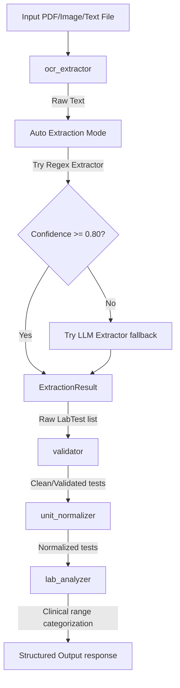

# Medical Tools - Lab Analyzer Engine (Phase 1)

A robust, production-ready python package for extracting, validating, normalizing, and clinically analyzing laboratory reports (e.g. blood panels, urine panels, stool tests).

## Folder Structure

```text
medical_tools/
├── extractors/
│   ├── regex_extractor.py      # Regex-based biomarker extractor
│   └── llm_extractor.py        # LLM-based biomarker extractor (fallback)
│
├── knowledge_base/
│   └── lab_ranges.json         # Reference ranges, clinical alerts, and aliases
│
├── tests/
│   ├── test_regex.py           # Unit tests for regex extractor
│   ├── test_pipeline.py        # Unit tests for full pipeline execution
│   ├── test_analyzer.py        # Unit tests for rule engine ranges
│   ├── test_validator.py       # Unit tests for marker validation
│   └── test_normalizer.py      # Unit tests for unit conversion factors
│
├── examples/
│   ├── blood.py                # Blood report pipeline analysis demo
│   ├── urine.py                # Urine report pipeline analysis demo
│   └── ocr_only.py             # OCR text extraction demo
│
├── __init__.py                 # Clean package API exports
├── config.py                   # Central settings (confidence threshold, etc.)
├── logger.py                   # Structured log system ('telemedicine')
├── validator.py                # Structural and semantic validation layer
├── confidence.py               # Calculation helper for matching confidence
├── schemas.py                  # LabTest and ExtractionResult dataclasses
├── exceptions.py               # Package exceptions (OCRFailure, etc.)
├── version.py                  # Package version ("1.0.0")
│
├── ocr_extractor.py            # Digital and scanned report text extractor
├── unit_normalizer.py          # Unit conversion and multiplier logic
├── lab_analyzer.py             # Clinical reference ranges rule engine
└── report_pipeline.py          # Integrated laboratory report pipeline
```

## Architecture & Pipeline Flow

The package operates as a deterministic rule-based medical reasoning engine, structured in a sequential pipeline:



1. **OCR Text Extraction (`ocr_extractor.py`)**: Uses digital text extraction from PDFs, with fallback to PaddleOCR for scanned PDFs and image files (`.png`, `.jpg`, `.jpeg`), and direct cleaning for plain text testing files (`.txt`).
2. **Biomarker Extraction (`extractors/`)**: Matches marker names and aliases using length-descending regex aliases, with high-accuracy LLM fallback if regex confidence is below `0.80`.
3. **Validation (`validator.py`)**: Checks extracted markers against the reference database to discard unrecognized markers, validates types (e.g. numeric values converted to float), and checks units.
4. **Unit Normalization (`unit_normalizer.py`)**: Automatically normalizes values depending on their extracted unit representations (e.g. converting WBC count from `10^3/uL` to `cells/uL`).
5. **Clinical Analysis (`lab_analyzer.py`)**: Checks age and sex-specific ranges for the matched marker using lookup tables, generating Low, High, Normal, or Abnormal alerts alongside possible clinical causes and suggested follow-ups.

## Features

- **High-performance Lookup**: Reference lookup built once at package load, reducing matching times to $O(1)$.
- **Structured Outputs**: All interfaces return structured Dataclasses (`LabTest`, `ExtractionResult`) which are backward-compatible with mapping types and dictionary unpacking.
- **Robust Type Safety**: Flatter ranges parsing with early returns, type annotations, and custom exception classes.
- **Synthesized Data**: Standardized logging layout outputting structured logs directly to the system console.

## Example Output

Running the pipeline on a blood report (`Hemoglobin 14.5 g/dL`, `Platelets 250 cells/uL`):

```json
{
    "metadata": {
        "source": "regex",
        "confidence": 1.0,
        "markers_found": 2,
        "report_type": "blood"
    },
    "extracted_tests": [
        {
            "marker": "hemoglobin",
            "display_name": "Hemoglobin",
            "value": 14.5,
            "unit": "g/dL"
        },
        {
            "marker": "platelets",
            "display_name": "Platelet Count",
            "value": 250000.0,
            "unit": "cells/uL"
        }
    ],
    "analysis": {
        "summary": {
            "total_tests": 2,
            "normal": 2,
            "abnormal": 0,
            "unknown": 0,
            "analysis_version": "1.0",
            "processed_markers": 2
        },
        "results": [
            {
                "status": "NORMAL",
                "details": {
                    "meaning": "Value is within reference range.",
                    "possible_causes": [],
                    "follow_up": []
                },
                "marker": "Hemoglobin",
                "value": 14.5,
                "unit": "g/dL",
                "normal_range": {
                    "min": 13.5,
                    "max": 17.5
                }
            }
        ]
    }
}
```

## Running Verification

To execute all unit tests:
```bash
.venv/bin/python3 -m unittest discover -s medical_tools/tests
```

To run demo scripts:
```bash
.venv/bin/python3 medical_tools/examples/blood.py
.venv/bin/python3 medical_tools/examples/urine.py
```
